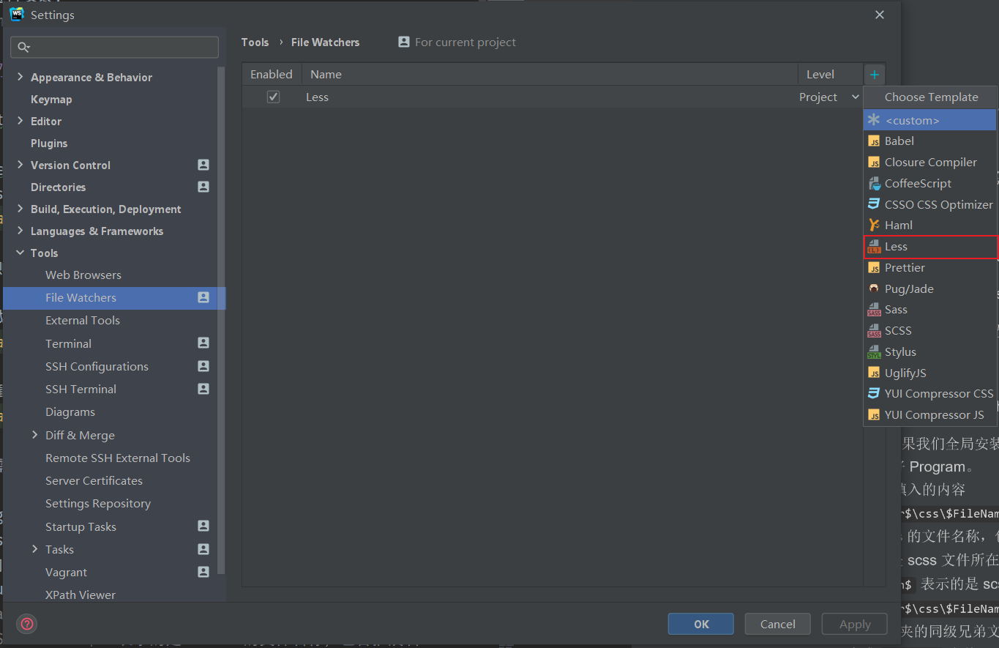
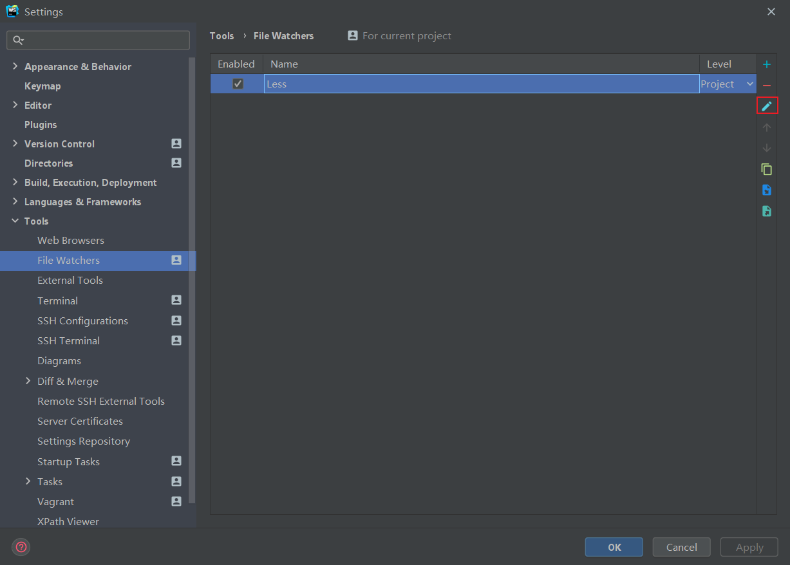
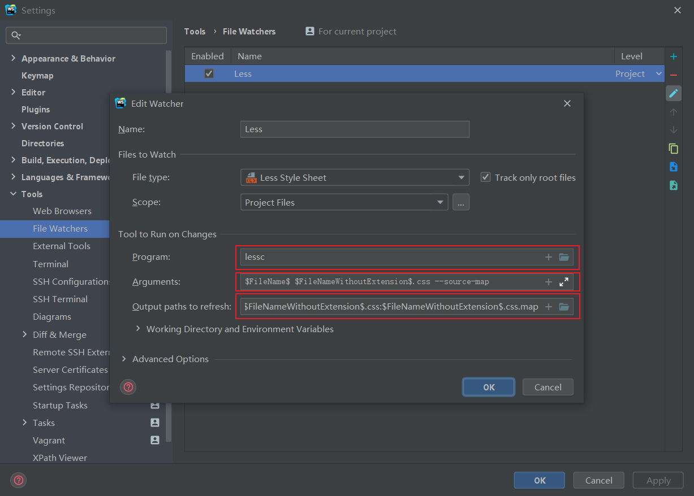

<!-- START doctoc generated TOC please keep comment here to allow auto update -->
<!-- DON'T EDIT THIS SECTION, INSTEAD RE-RUN doctoc TO UPDATE -->
**Table of Contents**  *generated with [DocToc](https://github.com/thlorenz/doctoc)*

- [Less学习总结](#less%E5%AD%A6%E4%B9%A0%E6%80%BB%E7%BB%93)
  - [1. Less是什么](#1-less%E6%98%AF%E4%BB%80%E4%B9%88)
  - [2. Less的学习资料](#2-less%E7%9A%84%E5%AD%A6%E4%B9%A0%E8%B5%84%E6%96%99)
  - [3. 安装](#3-%E5%AE%89%E8%A3%85)
  - [4. 配置 webstorm 实现 less 的自动编译](#4-%E9%85%8D%E7%BD%AE-webstorm-%E5%AE%9E%E7%8E%B0-less-%E7%9A%84%E8%87%AA%E5%8A%A8%E7%BC%96%E8%AF%91)
  - [5. Less基础](#5-less%E5%9F%BA%E7%A1%80)
    - [1. 注释（comments）](#1-%E6%B3%A8%E9%87%8Acomments)
    - [2. 变量（variable）](#2-%E5%8F%98%E9%87%8Fvariable)
    - [3. 嵌套（nesting）](#3-%E5%B5%8C%E5%A5%97nesting)
    - [4. 混合（mixins）](#4-%E6%B7%B7%E5%90%88mixins)
    - [5. 导入 -- `@import`](#5-%E5%AF%BC%E5%85%A5----import)
    - [6. 运算（operation）](#6-%E8%BF%90%E7%AE%97operation)
    - [7. 继承（extend）](#7-%E7%BB%A7%E6%89%BFextend)
    - [8. 一种新的居中方式](#8-%E4%B8%80%E7%A7%8D%E6%96%B0%E7%9A%84%E5%B1%85%E4%B8%AD%E6%96%B9%E5%BC%8F)
    - [9. 避免编译](#9-%E9%81%BF%E5%85%8D%E7%BC%96%E8%AF%91)
    - [10. 循环](#10-%E5%BE%AA%E7%8E%AF)
    - [11. 数据类型](#11-%E6%95%B0%E6%8D%AE%E7%B1%BB%E5%9E%8B)
    - [12. 内置函数](#12-%E5%86%85%E7%BD%AE%E5%87%BD%E6%95%B0)
      - [1. 逻辑运算函数（Logical Functions）](#1-%E9%80%BB%E8%BE%91%E8%BF%90%E7%AE%97%E5%87%BD%E6%95%B0logical-functions)
      - [2. 字符串函数（String Functions）](#2-%E5%AD%97%E7%AC%A6%E4%B8%B2%E5%87%BD%E6%95%B0string-functions)
      - [3. 数组函数（List Functions）](#3-%E6%95%B0%E7%BB%84%E5%87%BD%E6%95%B0list-functions)
      - [4. 数学函数（Math Functions）](#4-%E6%95%B0%E5%AD%A6%E5%87%BD%E6%95%B0math-functions)
      - [5. 类型函数（Type Functions）](#5-%E7%B1%BB%E5%9E%8B%E5%87%BD%E6%95%B0type-functions)
      - [6. 杂项函数（Misc Functions）](#6-%E6%9D%82%E9%A1%B9%E5%87%BD%E6%95%B0misc-functions)
      - [7. 颜色定义函数（Color Definition Functions）](#7-%E9%A2%9C%E8%89%B2%E5%AE%9A%E4%B9%89%E5%87%BD%E6%95%B0color-definition-functions)
      - [8. 颜色通道函数（Color Channel Functions）](#8-%E9%A2%9C%E8%89%B2%E9%80%9A%E9%81%93%E5%87%BD%E6%95%B0color-channel-functions)
      - [9. 颜色操作函数（Color Operation Functions）](#9-%E9%A2%9C%E8%89%B2%E6%93%8D%E4%BD%9C%E5%87%BD%E6%95%B0color-operation-functions)
      - [10. 颜色混合函数（Color Blending Functions）](#10-%E9%A2%9C%E8%89%B2%E6%B7%B7%E5%90%88%E5%87%BD%E6%95%B0color-blending-functions)

<!-- END doctoc generated TOC please keep comment here to allow auto update -->

# Less学习总结

## 1. Less是什么

1. Less是一个css预处理器。可以帮助我们以html元素的嵌套方式书写css代码，最后经过工具编译后，成为可用的css代码。

2. Less引入了变量、函数、混合、嵌套等内容，能够方便的帮助我们书写css样式。

## 2. Less的学习资料
1. 官方网站：[Less英文网站](http://lesscss.org/)

2. 中文网站：[Less中文网站](https://less.bootcss.com)

## 3. 安装

1. Less 不像 Sass有多种实现，Less 只有一种实现。所以我们直接使用 npm 进行安装：
   - `npm install -g less`

## 4. 配置 webstorm 实现 less 的自动编译

使用 webstorm 可以实现对 less 的自动编译。

2. 打开 webstorm 的 setting，找到 Tools 中的 File Watchers，如下图所示：


3. 点击右侧的 + ，选择 less，表示我们监测的是 less 文件。

4. 添加完成以后，需要进行配置。选中这个 less 配置项，如下所示：


5. 点击编辑按钮，进入配置页面：


6. 我们只需关注 Program、Arguments 和 Output path to refresh 这个三个选项。
   - Program 配置 less 编译器。如果我们全局安装的是 less，则 webstorm 会自动检测 less 编译器的安装路径，自动帮助我们配置好 Program。
   - Arguments 编译命令的参数。填入的内容是：`$FileName$:$FileNameWithoutExtension$.css`
     - `$FileName$` 表示的是 less 的文件名称，包含扩展名：`.scss`。
     - `$FileParentDir$` 表示的是 less 文件所在的路径的父路径
     - `$FileNameWithoutExtension$` 表示的是 less 文件不包含扩展名的文件名
     - `$FileName$:$FileNameWithoutExtension$.css` 的意思是：将编译后的 css 文件输出到 scss 文件所在文件夹。
   - Output path to refresh 生成 `.css.map` 文件。配置为 `$FileNameWithoutExtension$.css:$FileNameWithoutExtension$.css.map`，这个配置项是默认的，所以我们保持默认就好了。

7. 配置完成后，webstorm 就能监测 less 文件并且自动编译为 css 文件了。

## 5. Less基础

### 1. 注释（comments）

1. 以 `//` 开头的注释，不会被编译到css文件中。

2. 以 `/**/` 包裹的注释，会被编译到css文件中。

### 2. 变量（variable）

1. 使用 `@` 声明一个变量：`@color: pink;`

2. 作为普通属性值来使用：直接使用 `@color`。

3. 属性和选择器也可以被定义为变量,使用时要加上大括号{}，即 `@{}` 的形式。

4. 变量为 url，使用时也要加上大括号{}，即 `@{}` 的形式。

5. 示例代码如下：
   - 编译前：
     ```less
        @color: pink;
        @m: margin;
        @selector: #wrap;
        @imgUrl: 'http://www.xyz.com/aaa.jpg';
        // 清除元素的默认样式
        /*清除元素的默认样式*/
        * {
          //margin: 0;
          @{m}: 0;
          padding: 0;
        }
        @{selector} {
          position: relative;
          width: 300px;
          height: 400px;
          border: 1px solid black;
          margin: 0 auto;
       // 注意，使用url()要加上单引号（''），否则不会被解析为css
          background-image: url('@{imgUrl}');
          .inner {
            position: relative;
            top: calc(50% - 50px);
            left: calc(50% - 50px);
            background-color: @color;
            height: 100px;
            width: 100px;
          }
        }
     ```
   - 编译后：
     ```css
        /*清除元素的默认样式*/
        * {
          margin: 0;
          padding: 0;
        }
        #wrap {
          position: relative;
          width: 300px;
          height: 400px;
          border: 1px solid black;
          margin: 0 auto;
          background-image: url('http://www.xyz.com/aaa.jpg');
        }
        #wrap .inner {
          position: relative;
          top: calc(50% - 50px);
          left: calc(50% - 50px);
          background-color: pink;
          height: 100px;
          width: 100px;
        }
     ```

6. 不推荐将属性名和选择器定义为变量。更常用的是将普通的属性值定义为变量。

7. **注意**，使用 url() 要加上单引号（''），否则不会被解析为 css。

8. less 中定义的变量的作用范围时块级作用域。使用变量时，是先加载，后赋值。即我们可以先使用一个变量，后给它赋值。
   - 编译前：
     ```less
        @num: 1;
        div {
          .class {
            @num: 2;
            three: @num;
            @num: 3;
          }
        
          one: @num;
        }
     ```
   - 编译后：
     ```css
        div {
          one: 1;
        }
        div .class {
          three: 3;
        }
     ```
     在编译过程中，`.class`作用域内，`@num` 先被使用，而他的值，最开始是 2，后来是被覆盖为 3，所以，最终 `@num` 的值为3。如编译结果所示。
 
### 3. 嵌套（nesting）

1. 基本的嵌套就是按照html的嵌套顺序进行。

2. 嵌套与伪类一起使用 —— `&`的使用
   - 通过我们使用伪类，比如说是 `:hover`，必须将伪类和选择器写在一起：`.class:hover {}`。在 less 中，如果我们直接将伪元素嵌套到某个选择器里面（传统思维），如下所示：
     ```less
        #wrap {
          position: relative;
          width: 300px;
          height: 400px;
          border: 1px solid black;
          margin: 0 auto;
          .inner {
            position: relative;
            top: calc(50% - 50px);
            left: calc(50% - 50px);
            background-color: @color;
            height: 100px;
            width: 100px;
            :hover {
              background-color: blue;
            }
          }
        }
     ``` 
     编译后，是这样的：
     ```css
        #wrap {
          position: relative;
          width: 300px;
          height: 400px;
          border: 1px solid black;
          margin: 0 auto;
        }
        #wrap .inner {
          position: relative;
          top: calc(50% - 50px);
          left: calc(50% - 50px);
          background-color: pink;
          height: 100px;
          width: 100px;
        }
        #wrap .inner :hover {
          background-color: blue;
        }
     ```   
   - `:hover`前面多一个空格，完全不是伪类的正常用法。所以，在less中，我们使用 `&` 来表示对父级的引用。将 `&` 与伪类结合，如下所示：
     ```less
          #wrap {
              position: relative;
              width: 300px;
              height: 400px;
              border: 1px solid black;
              margin: 0 auto;
              .inner {
                  position: relative;
                  top: calc(50% - 50px);
                  left: calc(50% - 50px);
                  background-color: @color;
                  height: 100px;
                  width: 100px;
                  &:hover {
                      background-color: blue;
                  }
              }
          }
     ```
     编译后的css代码：
     ```css
        #wrap {
          position: relative;
          width: 300px;
          height: 400px;
          border: 1px solid black;
          margin: 0 auto;
        }
        #wrap .inner {
          position: relative;
          top: calc(50% - 50px);
          left: calc(50% - 50px);
          background-color: pink;
          height: 100px;
          width: 100px;
        }
        #wrap .inner:hover {
          background-color: blue;
        }
     ```
     这样就编译出了正确的结果：`#wrap .inner:hover {}`。
3. `&`表示对父级的引用。

### 4. 混合（mixins）

1. 混合就是将一系列属性从一个规则集中引入到另外一个规则集的方式。

2. 混合模式的规则以点 `.` 开头。

3. 普通混合
   - 我们自己定义一套规则，然后再另外的规则集中引用：
     - 编译前：
       ```less
          .generalStyle {
            position: relative;
            background-color: pink;
            height: 100px;
            width: 100px;
          } 
          #wrap {
            position: relative;
            width: 300px;
            height: 400px;
            border: 1px solid black;
            margin: 0 auto;
            .inner {
              top: calc(50% - 50px);
              left: calc(50% - 50px);
              .generalStyle;
            }
            .inner2 {
              top: calc(50% - 100px);
              left: calc(50% - 100px);
              .generalStyle;
            }
          }
       ```
     - `.generalStyle` 就是我们自定义的规则集合。我们在其他规则集中引用这个规则。编译后的结果如下所示：
       ```css
          .generalStyle {
            position: relative;
            background-color: pink;
            height: 100px;
            width: 100px;
          }
          #wrap {
            position: relative;
            width: 300px;
            height: 400px;
            border: 1px solid black;
            margin: 0 auto;
          }
          #wrap .inner {
            top: calc(50% - 50px);
            left: calc(50% - 50px);
            position: relative;
            background-color: pink;
            height: 100px;
            width: 100px;
          }
          #wrap .inner2 {
            top: calc(50% - 100px);
            left: calc(50% - 100px);
            position: relative;
            background-color: pink;
            height: 100px;
            width: 100px;
          }
       ```
     - 顺利的将自定义规则引入到另外一套规则中。注意，自定义规则也被编译到css结果中了。
4. 不带输出的混合
   - 所谓的不带输出，值得是我们自定义规则的名称后面加一对括号()，类似于定义函数。使用的时候，直接使用规则名称，不加括号()。此种混合的方式，在编译后的css文件中不会出现我们自定义的规则。
   - 编译前：
       ```less
          .generalStyle() {
            position: relative;
            background-color: pink;
            height: 100px;
            width: 100px;
          }
        
          #wrap {
            position: relative;
            width: 300px;
            height: 400px;
            border: 1px solid black;
            margin: 0 auto;
            .inner {
              top: calc(50% - 50px);
              left: calc(50% - 50px);
              .generalStyle;
            }
            .inner2 {
              top: calc(50% - 100px);
              left: calc(50% - 100px);
              .generalStyle;
            }
          }
       ```
   - 编译后的css代码：
       ```css
          #wrap {
            position: relative;
            width: 300px;
            height: 400px;
            border: 1px solid black;
            margin: 0 auto;
          }
          #wrap .inner {
            top: calc(50% - 50px);
            left: calc(50% - 50px);
            position: relative;
            background-color: pink;
            height: 100px;
            width: 100px;
          }
          #wrap .inner2 {
            top: calc(50% - 100px);
            left: calc(50% - 100px);
            position: relative;
            background-color: pink;
            height: 100px;
            width: 100px;
          }
       ```

5. 带参数的混合
   - 在自定义规则时，加入形参，使用时，传入实参，如下所示：
       ```less
          .generalStyle(@width, @height, @color) {
            position: relative;
            background-color: @color;
            height: @height;
            width: @width;
          }
          
          #wrap {
            position: relative;
            width: 300px;
            height: 400px;
            border: 1px solid black;
            margin: 0 auto;
            .inner {
              top: calc(50% - 50px);
              left: calc(50% - 50px);
              //.generalStyle;
              .generalStyle(100px, 100px, blue)
            }
            .inner2 {
              top: calc(50% - 100px);
              left: calc(50% - 100px);
              //.generalStyle;
              .generalStyle(100px, 100px, green)
            }
          }
       ```
   - 编译后的css代码如下：
       ```css
          #wrap {
            position: relative;
            width: 300px;
            height: 400px;
            border: 1px solid black;
            margin: 0 auto;
          }
          #wrap .inner {
            top: calc(50% - 50px);
            left: calc(50% - 50px);
            position: relative;
            background-color: blue;
            height: 100px;
            width: 100px;
          }
          #wrap .inner2 {
            top: calc(50% - 100px);
            left: calc(50% - 100px);
            position: relative;
            background-color: green;
            height: 100px;
            width: 100px;
          }
       ```
   - 使用带参数的混合模式，自定义的规则仍然不会被编译到css文件中。同时还可以根据不同的选择器传入不同的参数，非常灵活和方便。

6. 带参数并且有默认值的混合
   - 在自定义规则时，可以给参数设置默认值。
     ```less
          .generalStyle(@width: 100px, @height: 100px, @color: pink) {
            position: relative;
            background-color: @color;
            height: @height;
            width: @width;
          }
          
          #wrap {
            position: relative;
            width: 300px;
            height: 400px;
            border: 1px solid black;
            margin: 0 auto;
            .inner {
              top: calc(50% - 50px);
              left: calc(50% - 50px);
              //.generalStyle;
              //.generalStyle(100px, 100px, blue);
              .generalStyle();
            }
            .inner2 {
              top: calc(50% - 100px);
              left: calc(50% - 100px);
              //.generalStyle;
              //.generalStyle(100px, 100px, green);
              .generalStyle();
            }
          }
     ```
   - 默认参数使用冒号 `:` 的形式进行赋值。编译后的css代码如下所示：
     ```css
          #wrap {
            position: relative;
            width: 300px;
            height: 400px;
            border: 1px solid black;
            margin: 0 auto;
          }
          #wrap .inner {
            top: calc(50% - 50px);
            left: calc(50% - 50px);
            position: relative;
            background-color: pink;
            height: 100px;
            width: 100px;
          }
          #wrap .inner2 {
            top: calc(50% - 100px);
            left: calc(50% - 100px);
            position: relative;
            background-color: pink;
            height: 100px;
            width: 100px;
          }
     ```
7. 带有多个参数的混合
8. 命名参数
   - 某些情况下，我们需要指定给一个参数赋值，而其他的参数使用默认值。使用命名参数即可解决这个问题。
     ```less
        .generalStyle(@width: 100px, @height: 100px, @color: pink) {
          position: relative;
          background-color: @color;
          height: @height;
          width: @width;
          }
          
        #wrap {
          position: relative;
          width: 300px;
          height: 400px;
          border: 1px solid black;
          margin: 0 auto;
          .inner {
            top: calc(50% - 50px);
            left: calc(50% - 50px);
            //.generalStyle;
            //.generalStyle(100px, 100px, blue);
            //.generalStyle();
            // 命名参数
            .generalStyle(@color: black);
          
          }
          .inner2 {
            top: calc(50% - 100px);
            left: calc(50% - 100px);
            //.generalStyle;
            //.generalStyle(100px, 100px, green);
            //.generalStyle();
            // 命名参数
            .generalStyle(@color: yellow);
          }
        }
       ```
   - 在使用时，`@color: yellow`这种形式，即可为指定的参数赋值，而其他参数依旧使用默认值。
   - 注意，命名参数，必须和默认值结合才能使用。
9. 匹配模式
   - 匹配模式类似于函数重载。我们定义多个名字相同但参数不同的规则，使用时，根据传入的参数数量以及类型，去寻找相应的规则。举个例子，我们使用 css 定义一个三角形，可以控制其方向。
   - 我们可以定义一个 less 模块，名称为 `triangle.less`，然后再内部定义几个同名但是参数不同的规则，每个规则用来控制三角形的方向，如下所示：
     ```less
        // triangle.less
        // 通用规则
        // 使用@_这个参数，表示我们只要调用triangle()，就首先会调用这个规则，然后才会去使用精确匹配的规则
        .triangle(@_, @color) {
          width: 0;
          height: 0;
          border-width: 50px;
          border-style: solid;
        }
        
        // 向下
        .triangle(B, @color) {
          border-color: @color transparent transparent transparent;
        }
        // 向左
        .triangle(L, @color) {
          border-color: transparent @color transparent transparent;
        }
        // 向上
        .triangle(T, @color) {
          border-color: transparent transparent @color transparent;
        }
        // 向右
        .triangle(R, @color) {
          border-color: transparent transparent transparent @color ;
        }
     ```
   - 在这个模块中，定义了 5 个规则，其中第一个是通用规则，后面四个是控制方向的。在第一个规则中使用了 `@_` 这个参数，表示我们只要调用 triangle()，就首先会调用这个规则，然后才会去使用精确匹配的规则。除了 `@_` 这个参数，其余参数要和其他规则的参数相同，不能没有。（函数重载的规则）
   - 使用时，首先引入 `triangle.less` 这个模块，然后直接使用`.triangle()`。根据参数的不同去匹配不同的规则。
       ```less
          // 02.less
          @import './triangle';
          
          #wrap {
            .inner {
              .triangle(L, red);
            }
            .inner2 {
              .triangle(T, blue);
            }
          }
       ```
10. `arguments` 变量
    - 这个 `arguments` 变量类似于 JavaScript 中函数的`arguments`。用来接收传递进来的实参。
     ```less
        .borderStyle(@with: 1px, @style: solid, @color: red) {
          border: @arguments;
        }
        
        #wrap {
          .inner {
            width: 100px;
            height: 100px;
            .borderStyle();
          }
        }
     ```
    - 使用 `@arguments` 参数能够少写一点代码。实际上用的比较少。

### 5. 导入 -- `@import`

1. 导入一个 css 或者less文件，使用`@import`语法。如果时less文件，可以不用写后缀。
     ```less
        @import 'library';
        @import 'test.css';
     ``` 
2. 规则：
   - 如果使用 `.css` 扩展名，那么它将被视为 css 文件， `@import` 语句保持不变。
   - 如果包含任何其他扩展名，那么将被视为 less 文件并将被导入。
   - 如果没有 `.less` 的扩展，那么 less 会在文件末尾加上 `.less` 扩展名，并作为 less 文件导入。

### 6. 运算（operation）

1. 在 Less 中，可以进行加减乘除运算。算术运算符在加、减或比较之前会进行单位换算。计算的结果以最左侧操作数的单位类型为准。如果单位换算无效或失去意义，则忽略单位。无效的单位换算例如：px 到 cm 或 rad 到 % 的转换。例如：
   - 编译前：
     ```less
        #wrap {
          width: 300px;
          height: 400px;
          border: 1px solid black;
          margin: 0 auto;
          .inner {
            background-color: blue;
            // 200px;
            width: 100 + 100px;
            // 70px
            height: 50 - 10px + 30%;
          }
        
          .inner2 {
            background-color: yellow;
            // 150px
            width: 300px / 2;
            // 30%
            height: 2 * 15%;
          }
        }
     ```
   - 编译后的css代码：
     ```css
        #wrap {
          width: 300px;
          height: 400px;
          border: 1px solid black;
          margin: 0 auto;
        }
        #wrap .inner {
          background-color: blue;
          width: 200px;
          height: 70px;
        }
        #wrap .inner2 {
          background-color: yellow;
          width: 150px;
          height: 30%;
        }
     ```
2. 注意：操作符（`+` `-` `*` `/` ）左右两侧都必须加上空格。

3. 使用乘除操作时，计算的结果以最左侧操作数的单位类型为准。
   - 编译前：
     ```less
        .inner3 {
            background-color: green;
            // 200px
            width: 20px * 10px;
            // 35%
            height: 70% / 2px;
          }
     ```
4. 尽量保持单位的一致。

5. 如果有乘除运算，保持所有操作数，只有一个带单位。

### 7. 继承（extend）

1. 参考资料：
   - [Less的Extend_Less继承](https://www.cnblogs.com/waibo/p/7911949.html)
   - [less 继承语法](https://blog.csdn.net/weixin_43245095/article/details/89163192)
   
2. 与面向对象中的继承类似。它允许一个选择器继承另一个选择器的样式。

3. 特点：
   - less 继承方便代码模块化
   - 继承不支持带参数

4. 继承的语法一：
   - 示例：
     ```less
           .center {
               position: relative;
               top: 50%;
               left: 50%;
               transform: translate(-50%, -50%);
           }
           #wrap {
               width: 300px;
               height: 400px;
               border: 1px solid black;
               margin: 0 auto;
               .inner:extend(.center) {
                   width: 100px;
                   height: 100px;
                   background-color: yellow;
             }
           }
     ```
   - 直接在选择器的后面，加上`:extend()`，传入的是待继承的样式——`.center`。
   - 编译后的css代码如下：
     ```css
          .center,
          #wrap .inner {
            position: relative;
            top: 50%;
            left: 50%;
            transform: translate(-50%, -50%);
          }
          #wrap {
            width: 300px;
            height: 400px;
            border: 1px solid black;
            margin: 0 auto;
          }
          #wrap .inner {
            width: 100px;
            height: 100px;
            background-color: yellow;
          }
     ```
   - 使用继承，生成的 css 代码中会有一个`.center,#wrap .inner {}`的群组选择器。这个选择器使用了父类 `.center` 的居中样式。将这个样式抽出，放在了群组选择器中，而没有放在 `#wrap .inner {}` 这个后代选择器中。
   
5. 继承的语法二：
   - 示例：
     ```less
        .center {
              position: relative;
              top: 50%;
              left: 50%;
              transform: translate(-50%, -50%);
        }
        #wrap {
              width: 300px;
              height: 400px;
              border: 1px solid black;
              margin: 0 auto;
              .inner {
                  &:extend(.center);
                  width: 100px;
                  height: 100px;
                  background-color: yellow;   
            }
          }
     ```
   - 使用`&`，将继承放入 `inner` 内部。`&:extend(.center)`。
   - 这两种语法编译后的css代码完全相同。
   
6. 继承所有状态
   - 有时候我们在父类样式中设置其他的状态，比如说是伪类选择器，那么如果我们想全部继承下来，就需要使用`all`关键字。
   - 示例：
     ```less
          .center {
              position: absolute;
              top: 0;
              left: 0;
              bottom: 0;
              right: 0;
              margin: auto;
          
          }
          
          .center:hover {
              background-color: green;
          }
          
          #wrap {
              position: relative;
              width: 300px;
              height: 400px;
              border: 1px solid black;
              margin: 0 auto;
              //.inner:extend(.center) {
              .inner {
                  // 使用all关键字，继承了了居中和悬浮样式
                  &:extend(.center all);
                  width: 100px;
                  height: 100px;
                  background-color: yellow;
          
            }
          
              .inner2 {
                  // 没有使用 all 关键字，只继承了居中，没有继承悬浮样式
                  &:extend(.center);
                  width: 50px;
                  height: 50px;
                  background-color: red;
              }
          }
     ```
   - inner 中，`&:extend(.center all);` 继承父类样式时，使用了 `all` 关键字，因此继承了居中和悬浮样式，而 inner2 中，`&:extend(.center)`，没有使用 `all` 关键字，因此只继承了居中样式。
   - 编译后的css代码如下：
     ```css
          .center,
          #wrap .inner,
          #wrap .inner2 {
            position: absolute;
            top: 0;
            left: 0;
            bottom: 0;
            right: 0;
            margin: auto;
          }
          .center:hover,
          #wrap .inner:hover {
            background-color: green;
          }
          #wrap {
            position: relative;
            width: 300px;
            height: 400px;
            border: 1px solid black;
            margin: 0 auto;
          }
          #wrap .inner {
            width: 100px;
            height: 100px;
            background-color: yellow;
          }
          #wrap .inner2 {
            width: 50px;
            height: 50px;
            background-color: red;
          }
     ```
   - 由 css 代码可以看出，`.center,#wrap .inner,#wrap .inner2 {}`这个群组选择器用来给 inner 和 inner2 设置居中样式。而`.center:hover,#wrap .inner:hover {}` 用来设置 inner 的悬浮样式。
   
7. 继承和混合的区别
   - 继承会生成一个群组选择器，将使用到父类样式的选择器统统放到一起，用逗号分隔。将父类样式放在这个群组选择器中。
   - 而混合，则是将一类规则放在每一个使用了这个规则的选择器中。
   - 继承没有代码冗余，实现了代码的复用。而混合则是将通用规则复制到每一个应用到这个规则的选择器中。
   - 继承不能传参，如果我们需要通过参数传递不同的变量值，我们只能使用混合的方式。
   - 继承的性能比混合高，灵活性比混合差。
   
### 8. 一种新的居中方式

1. 示例 css 代码：
   ```css
      #parent {
          position: relative;
      }
      #child {
          position: absolute;
          top: 0;
          left: 0;
          bottom: 0;
          right: 0;
          margin: auto;
          width: 100px;
          height: 100px;
      }
   ```
2. 父类的 `position` 属性设置为`relative`，而子类的 `position` 属性设置为 `absolute`，同时要求子类有固定的宽度和高度。设置了 `top`、`left`、`bottom` 和 `right` 均为0，最后设置了 `margin` 为 `auto`，即可实现垂直居中。

### 9. 避免编译

1. 语法：使用波浪线：`~`，在某行样式前面加上这个，less 就不会编译了。

2. 使用 calc() 进行混合运算，正常状态下，less 会帮助我们计算出最终的结果，但是，我们想让浏览器帮助我们计算，不需要 less 进行编译。所有可以这样写：
   ```less
      .inner {
          width: ~"calc(100 + 200px)";
      }
   ```
3. 注意，波浪线：`~`后面必须是字符串，而且是双引号`""`形式的字符串。  
4. 编译后的 css 代码：
   ```css
      .inner {
           width: calc(100 + 200px);
      }
   ```
   less 没有编译 calc() 函数。

### 10. 循环

1. 使用`each()` 和 `range()` 可以实现 for 循环。
   - 示例：
     ```less
        each(range(1px, 4px), {
             set-@{index} {
                 width: @value;
             }
        })
     ```
     
### 11. 数据类型

1. 数字：`1`，`2`，`13`，`10px`

2. 字符串：有引号字符串与无引号字符串，`"foo"`，`'bar'`，`baz`

3. 颜色：`blue`，`#04a3f9`，`rgba(255, 0, 0, 0.5)`

4. 布尔型：`true`，`false`

5. 空值：`null`

6. 数组（list）：用空格或逗号作分隔符，`1.5em 1em 0 2em`，`Helvetica, Arial, sans-serif`。数组的索引从1开始。

7. maps, 相当于 JavaScript 的 object，`{key1: value1, key2: value2}`

### 12. 内置函数

#### 1. 逻辑运算函数（Logical Functions）

1. `if`
   - 语法：`if((condition), value1, value2)`
   - condition 为布尔表达式，condition 为 true，返回value1，为 false 返回 value2。
   - 示例：
     ```less
        @condition: 4;
        .test {
            margin: if((@condition > 1), 10px, 5px);   // 10px
        }
     ```
   - 示例2：
     ```less
        if(not (true), foo, bar);  // bar
        if((true) and (2 > 1), foo, bar); // foo
        if((false) or (isstring("boo!")), foo, bar); // foo
     ```
   - 可以使用 `not`、`and`、`or` 进行逻辑判断。
   - 每个条件要加上括号。
   
2. `boolean`
   - 计算一个表达式是 true 还是 false。通常和 if() 一起使用。
   - 示例：
     ```less
        @bg: black;
        @bg-light: boolean(luma(@bg) > 50%);
        
        div {
            background: @bg;
            color: if(@bg-light, black, white);  // white
        }
     ```

3. `when`
   - `when(@contion) {}`
   - @condition 为 true 时，生成后面的规则，为 false 时，什么也不操作。
   - 可以使用的比较符：`<`、`>`、`<=`、`>=`、`=`，可以使用比较运算符 `=` 来比较数字，字符串、标识符等，而其余的运算符只能与数字一起使用。
   - 示例 - 单一条件
     ```less
        .mixin(@a) when(@a = 20px) {
            color: red;
        }
        .mixin(@a) when(@a > 20px) {
            color: blue;
        }
        
        .mixin(@a) {
            font-size: @a;
        }
        
        .test {
            .mixin(30px);
        }
     ```
     编译后：
     ```css
        .test {
          color: blue;
          font-size: 30px;
        }
     ```
   - 示例 - 多个条件
     ```less
        .image-width(@img-width) when((@img-width > 20px) or (@img-width < 10px)) {
            img {
                width: @img-width * 1.5;
            }
        }
        
        .test-2 {
            .image-width(8px);
        }
     ```
     编译后：
     ```css
        .test-2 img {
          width: 12px;
        }
     ```
 
#### 2. 字符串函数（String Functions）

1. `escape`
   - 对字符串中的特殊字符进行转义。使用的是 ` URL-encoding` 规则。
   - 不会被转义的字符：`,`, `/`, `?`, `@`, `&`, `+`, `'`, `~`, `!` 和 `$`。
   - 会被转义的字符：`\<space\>`, `#`, `^`, `(`, `)`, `{`, `}`, `|`, `:`, `>`, `<`, `;`, `]`, `[` 和 `=`。
   - 示例：
     ```less
         .test::after {
             content: escape('a=b#(c$d)');  // a%3Db%23%28c$d%29
         }
     ```
2. `e`
   - css 转义，用来替换 `~` 语法。
   - 接收一个字符串，返回的时不带引号的字符串内容。
   - 示例：
     ```less
        .test::after {
            content: e('calc(100px - 50%)');
        }
     ```
   - 编译后：
     ```css
        .test::after {
          content: calc(100px - 50%);
        }
     ```
3. `% format`
   - `%(string, arguments ...)` 格式字符串。
   - string：带占位符的字符串，占位符必须以 % 开头，占位符字母只能是：`s`，`S`，`d`，`D`，`a` 或者 `A`。小写的占位符不会对 arguments 中的特殊字符进行转义，而大写的占位符会对 arguments 中的特殊字符进行转义。
   - arguments：用来取代占位符的表达式或者字符串
   - 占位符
     - `d`，`D`，`a`，`A`：能够被任何参数替换，如果被替换的值是整个字符串，包含引号。
     - `s`，`S`：能够被任何表达式替换，如果被替换的值是字符串，只包含字符串本身的内容，不包含引号。
   - 示例：
     ```less
        format-a-d: %("repetitions: %a file: %d", 1 + 2, "directory/file.less");  // format-a-d: "repetitions: 3 file: "directory/file.less"";
        format-a-d-upper: %('repetitions: %A file: %D', 1 + 2, "directory/file.less");  // format-a-d-upper: 'repetitions: 3 file: %22directory%2Ffile.less%22';
        format-s: %("repetitions: %s file: %s", 1 + 2, "directory/file.less");  // format-s: "repetitions: 3 file: directory/file.less";
        format-s-upper: %('repetitions: %S file: %S', 1 + 2, "directory/file.less");  // format-s-upper: 'repetitions: 3 file: directory%2Ffile.less';
     ```
4. `replace`
   - `replace(string, pattern, replacement, flags)`
   - 类似于 JavaScript 中的字符串的 replace() 函数，用法与参数都相似。
   - 前三个参数必须，最后一个参数是可选的。
   - 示例：
     ```less
        replace("Hello, Mars?", "Mars\?", "Earth!");  // "Hello, Earth!"
        replace("One + one = 4", "one", "2", "gi");  // "2 + 2 = 4"
        replace('This is a string.', "(string)\.$", "new $1.");  // 'This is a new string.'
        replace(~"bar-1", '1', '2');  // bar-2
     ```
  
#### 3. 数组函数（List Functions）

1. `length`
   - `length(@list)`
   - 获取一个数组的长度
   - 示例：
     ```less
        @num: 1, 3, 5, 7;
        length(@num);  // 4
     ```
2. `extract`
   - `extract(@list, @index)`
   - 根据索引，从一个指定的数组中获取元素。
   - 示例：
     ```less
        @str: 'one', 'two', 'three', 'four';
        extract(@str, 2);  // 'two'
     ```
3. `range`
   - `range(start, end, step)`
   - 根据 start 和 end，生成一个数组，步长是 step。step 可选，默认步长是 1。
   - 示例：
     ```less
        range(1px, 10px, 2);  // 1px 3px 5px 7px 9px
     ```
4. `each`
   - `each(@list, @rule)`
   - list：数组或者对象
   - rules - 任何 css 规则或者混合（mixins）
   - 示例 - 数组：
     ```less
        @str: one, two;
        each(@str, {
            .sel-@{value} {
                a: @{value};
            }
        })
     ```
     编译后：
     ```css
        .sel-one {
          a: one;
        }
        .sel-two {
          a: two;
        }
     ```
   - `@index`、`@value` 表示数组的索引和数组项。
   - 示例 - 对象：
        ```less
           .set {
               each(@set, {
                   @{key}-@{index}: @value
               })
           }
        ```
        编译后：
        ```css
           .set {
             one-1: blue;
             two-2: green;
             three-3: red;
           }
        ```
   - `@key`、`@value` 表示对象的 key 和 value。`@index` 表示第几次变量。
   - 结合 range()，可以实现 for 循环：
     ```less
        each(range(1px, 4px), {
            set-@{index} {
                width: @value;
            }
        })
     ```
      编译后：
      ```css
         set-1 {
           width: 1px;
         }
         set-2 {
           width: 2px;
         }
         set-3 {
           width: 3px;
         }
         set-4 {
           width: 4px;
         }
      ```

#### 4. 数学函数（Math Functions）

1. `ceil`
   - `ceil(@float)`
   - 向上取整
   
2. `floor`
   - `floor(@float)`
   - 向下取整
   
3. `percentage`
   - `percentage(@number)`
   - 将浮点数转换为百分数
   
4. `round`
   - `round(@number, @decimalPlaces)`
   - 根据 `@decimalPlaces` 指定的位数对浮点数进行四舍五入。
   - `@decimalPlaces` 可选，默认是 0。
   - 示例：
     ```less
        @num: round(1.43, 1);  // 1.4
        @num: round(1.43);  // 1
     ```
5. `sqrt`
   - `sqrt(@num)`
   - 返回一个数的平方根，如果带单位，也会将单位返回。
   
6. `abs`
   - `abs(@num)`
   - 返回一个数的绝对值，如果带单位，也会将单位返回。

7. `sin`
   - `sin(@num)`
   - 计算一个数的正弦值
   
8. `asin`
   - `asin(@num)`
   - 计算一个数的反正弦值，`@num` 的值在 `-1` 到` 1` 之间，而返回值在 `-π/2` 和 `π/2` 之间。
   
9. `cos`
   - `cos(@num)`
   - 计算一个数的余弦值
   
10. `acos`
    - `acos(@num)`
    - 计算一个数的反余弦值，`@num` 的值在 `-1` 到` 1` 之间，而返回值在 `-π/2` 和 `π/2` 之间。
    
11. `tan`
    - `tan(@num)`
    - 计算一个数的正切值
    
12. `atan`
    - `atan(@num)`
    - 计算一个数的反余弦值，返回值在 `-π/2` 和 `π/2` 之间。
    
13. `pi`
    - `pi()`
    - 返回 π。
    
14. `pow`
    - `pow(@base, @exponent)`
    - 幂指数函数。
    
15. `mod`
    - `mod(@num1, @num2)`
    - 取余数。取 `@num1` 除以 `@num2` 的余数。能够处理负数和小数。
    - 示例：
      ```less
         mod(0cm, 0px);  // NaNcm
         mod(11cm, 6px);  // 5cm
         mod(-26%, -5);  // -1%
      ```
16. `min`
    - `min(@val1, @val2, ...)`
    - 获得参数列表中的最小值
    
17. `max`
    - `max(@val1, @val2, ...)`
    - 获得参数列表中的最大值

#### 5. 类型函数（Type Functions）

1. `isnumber`
   - `isnumber(@value)`
   - 判定 `@value` 是否为数字。
   
2. `isstring`
   - `isstring(@value)`
   - 判定 `@value` 是否为字符串。此处的字符串是带引号的字符串。
   
3. `iscolor`
   - `iscolor(@value)`
   - 判断 `@value` 是否为颜色
   - 示例：
     ```less
        iscolor(#ff0);     // true
        iscolor(blue);     // true
        iscolor("string"); // false
        iscolor(1234);     // false
        iscolor(56px);     // false
        iscolor(7.8%);     // false
        iscolor(keyword);  // false
        iscolor(url(...)); // false
     ```
4. `iskeyword`
   - `iskeyword(@value)`
   - 判断 `@value` 是否为 keyword。
   - 示例：
     ```less
        iskeyword(#ff0);     // false
        iskeyword(blue);     // false
        iskeyword("string"); // false
        iskeyword(1234);     // false
        iskeyword(56px);     // false
        iskeyword(7.8%);     // false
        iskeyword(keyword);  // true
        iskeyword(url(...)); // false
     ```
5. `isurl`
   - `isurl(@value)`
   - 判断 `@value` 是否为 url。
   - 示例：
     ```less
        isurl(#ff0);     // false
        isurl(blue);     // false
        isurl("string"); // false
        isurl(1234);     // false
        isurl(56px);     // false
        isurl(7.8%);     // false
        isurl(keyword);  // false
        isurl(url(...)); // true
     ```
6. `ispixel`
    - `ispixel(@value)`   
    - 判断 `@value` 是否是以 `px` 为单位
    - 示例：
      ```less
         ispixel(#ff0);     // false
         ispixel(blue);     // false
         ispixel("string"); // false
         ispixel(1234);     // false
         ispixel(56px);     // true
         ispixel(7.8%);     // false
         ispixel(keyword);  // false
         ispixel(url(...)); // false
      ``` 
7. `isem`
   - `isem(@value)`
   - 判断 `@value` 是否是以 `em` 为单位
   - 示例：
     ```less
        isem(#ff0);     // false
        isem(blue);     // false
        isem("string"); // false
        isem(1234);     // false
        isem(56px);     // false
        isem(7.8em);    // true
        isem(keyword);  // false
        isem(url(...)); // false
     ```
8. `ispercentage`
   - `ispercentage(@value)`
   - 判断 `@value` 是否是百分数
   - 示例：
     ```less
        ispercentage(#ff0);     // false
        ispercentage(blue);     // false
        ispercentage("string"); // false
        ispercentage(1234);     // false
        ispercentage(56px);     // false
        ispercentage(7.8%);     // true
        ispercentage(keyword);  // false
        ispercentage(url(...)); // false 
     ```
9. `isunit`
   - `isunit(@value, @unit)`
   - 判断 `@value` 是否是 `@unit` 指定的单位
   - 示例：
     ```less
        isunit(11px, px);  // true
        isunit(2.2%, px);  // false
        isunit(33px, rem); // false
        isunit(4rem, rem); // true
        isunit(56px, "%"); // false
        isunit(7.8%, '%'); // true
        isunit(1234, em);  // false
        isunit(#ff0, pt);  // false
        isunit("mm", mm);  // false
     ```
10. `isruleset`
   - `isruleset(@value)`
   - 判断 `@value` 是否是 css 规则集
   - 示例：
     ```less
        @rules: {
            color: red;
        }
        
        isruleset(@rules);   // true
        isruleset(#ff0);     // false
        isruleset(blue);     // false
        isruleset("string"); // false
        isruleset(1234);     // false
        isruleset(56px);     // false
        isruleset(7.8%);     // false
        isruleset(keyword);  // false
        isruleset(url(...)); // false
     ```

#### 6. 杂项函数（Misc Functions）

1. `color`
   - `color(@string)`
   - 将一个颜色字符串转换为颜色
   - `color("#aaa");  // #aaa`
   
2. `image-size`
   - `image-size(@string)`
   - 获取一个图片文件的尺寸
   - `image-size("file.png");  // 10px 10px`

3. `image-width`
   - `image-width(@string)`
   - 获取一个图片的宽度
   
4. `image-height`
   - `image-height(@string)`
   - 获取一个图片的宽度
   
5. `convert`
   - `convert(@value, @unit)`
   - 单位转换。第一个参数是带单位的数字，第二个参数是单位，如果二者匹配，就将转换后的带单位的值返回，不匹配的话，就将第一个参数返回。
   - 可以转换的单位包括：
     - 长度单位：`m`, `cm`, `mm`, `in`, `pt` 和 `pc`
     - 时间单位：`s` 和 `ms`
     - 角度单位：`rad`, `deg`, `grad` 和 `turn`
   - 示例：
     ```less
        convert(9s, "ms");  // 9000ms
        convert(14cm, mm);  // 140mm
        convert(8, mm) // 8
     ```
6. `data-uri`
   - `data-uri(@mimetype, @url)`
   - 将一个文件转换为指定编码的 data-uri。`@mimetype` 是 MIME 类型，值为字符串。而 `@url` 指的是资源的路径。
   - 如果 MIME 类型是以 `;base64` 结尾，那么就使用 base64编码。例如：`image/jpeg;base64` 就是指定 base64 编码。 而 `text/html` 则是使用 utf-编码。
   - 示例：
     ```less
        input: data-uri('../data/image.jpg');
        
        Output: url('data:image/jpeg;base64,bm90IGFjdHVhbGx5IGEganBlZyBmaWxlCg==');
     ```
7. `default`
   - `default()`
   - 与混合配合使用。如果某个混合使用了 `default()` 函数，使用时，如果没有与定义的混合匹配的，就使用默认的这个混合。
   - 基本使用：
     ```less
        .mixin(1)                   {x: 11}
        .mixin(2)                   {y: 22}
        .mixin(@x) when (default()) {z: @x}
        
        div {
          .mixin(3);
        }
        
        div.special {
          .mixin(1);
        }
     ```
     编译后：
     ```css
        div {
          z: 3;
        }
        div.special {
          x: 11;
        }
     ```
   - default() 的其他用法：[misc-functions-default](https://less.bootcss.com/functions/#misc-functions-default)
   
8. `unit`
   - `unit(@dimension, @unit)`
   - 移除或者改变某个值的单位。`@unit` 可选。
   - 示例：`unit(5, px); // 5px`
   
9. `get-unit`
   - `get-unit(@string)`
   - 返回一个值的单位。如果这个值没有单位，返回一个空值。
   - 示例：
     ```less
        get-unit(5px);  // px
        get-unit(5);  // nothing
     ```
10. `svg-gradient`
   - `svg-gradient(@direction, @color-list)`
   - 生成 svg 渐变。
   - 用法详解：[misc-functions-svg-gradient](https://less.bootcss.com/functions/#misc-functions-svg-gradient)
   
#### 7. 颜色定义函数（Color Definition Functions）

1. `rgb`
   - `rgb(@red, @green, @blue)`
   - 将三原色转换为十六进制的颜色字符串。
   - 参数的范围是 0 到 255，或者是 0% 到 100%。
   - 示例：`rgb(90, 129, 32);  // #5a8120`

2. `rgba`
   - `rgba(@red, @green, @blue, @alpha)`
   - 创建一个具有透明度的颜色
   - 三原色的范围是 0 到 255，或者是 0% 到 100%。而 alpha 通道的范围是 0 到 1 或者是 0% 到100%。
   
3. `argb`
   - 参考资料：[color-definition-functions-argb](https://less.bootcss.com/functions/#color-definition-functions-argb)

4. `hsl`
   - `hsl(@hue, @saturation, @lightness)`
   - @hue：色调，0 到 360 之间的整数，代表角度
   - @saturation: 饱和度， 0-100% 或者 0-1
   - @lightness: 亮度，0-100% 或者 0-1
   - 示例：`hsl(90, 100%, 50%); // #80ff00`
   
5. `hsla`
   - `hsl(@hue, @saturation, @lightness, @alpha)` 
   - 在 hsl 颜色的基础上，增加 alpha 通道，使得颜色具有透明性。
   
6. `hsv`
   - `hsv(@hue, @saturation, @value)`
   - 使用 hsv 颜色空间创建颜色
   
7. `hsva`
   - `hsv(@hue, @saturation, @value, @alpha)`
   - 在 hsv 颜色的基础上，增加 alpha 通道，使得颜色具有透明性。

#### 8. 颜色通道函数（Color Channel Functions）

1. `hue`
   - `hue(@color)`
   - 获取 hsl 颜色的色调（hue），范围是 0-360
   
2. `saturation`
   - `saturation(@color)`
   - 获取 hsl 颜色的饱和度（saturation），范围是 0% - 100%
   
3. `lightness`
   - `lightness(@color)`
   - 获取 hsl 颜色的亮度（lightness），范围是 0% - 100%
   
4. `hsvhue`
   - `hsvhue(@color)`
   - 获取 hsv 颜色的色调（hue），范围是 0-360

5. `hsvsaturation`
   - `hsvsaturation(@color)`
      - 获取 hsv 颜色的饱和度（saturation），范围是 0% - 100%

6. `hsvvalue`
   - `lightness(@color)`
   - 获取 hsl 颜色的value，范围是 0 - 100%

7. `red`
   - `red(@color)`
   - 获得 rgb 颜色的红色通道

8. `green`
   - `green(@color)`
   - 获得 rgb 颜色的绿色通道

9. `blue`
   - `blue(@color)`
   - 获得 rgb 颜色的蓝色通道

10. `alpha`
    - `alpha(@color)`
    - 获取一个颜色的 alpha 通道
    
11. `luma`
    - `luma(@color)`
    - 获取一个颜色的 luma 值。luma 指的是：perceptual brightness。即可感知的亮度。
    
12. `luminance`
    - `luminance(@color)`
    - 在不进行 gamma 校正的情况下，计算 luma 值

#### 9. 颜色操作函数（Color Operation Functions）

1. `saturate`
   - `saturate(@color, @amount, @method)`
   - 对 hsl 颜色中的饱和度（saturation）进行操作，提高其百分比。
   - `@color`：hsl 颜色
   - `@amount`：提高的百分比
   - `@method`：可选，默认是 absolute，表示是绝对值，如果原始值是 10%，`@amount` 设置为 10%，则变换后的值为 20%。如果设置为 relative，原始值是 10%，`@amount` 设置为 10%，则变换后是 11%。
   - 示例：
     ```less
        saturate(hsl(90, 80%, 50%), 20%); // hsl(90, 100%, 50%) --> #80ff00
        saturate(hsl(90, 80%, 50%), 20%, relative);  // hsl(90, 96%, 50%) --> #80fa05
     ```
2. `desaturate`
   - `desaturate(@color, @amount, @method)`
   - 对 hsl 颜色中的饱和度（saturation）进行操作，降低其百分比。
   - `@color`：hsl 颜色
   - `@amount`：降低的百分比
   - `@method`：可选，默认是 absolute，表示是绝对值，如果原始值是 20%，`@amount` 设置为 10%，则变换后的值为 10%。如果设置为 relative，原始值是 20%，`@amount` 设置为 10%，则变换后是 18%。
   - 示例：
     ```less
        desaturate(hsl(90, 80%, 50%), 20%); // hsl(90, 60%, 50%) --> #80cc33
        saturate(hsl(90, 80%, 50%), 20%, relative);  // hsl(90, 64%, 50%) --> #80d12e
     ```
3. `lighten`
   - `lighten(@color, @amount, @method)`
   - 对 hsl 颜色中的亮度（lightness）进行操作，提高其百分比。
   - `@color`：hsl 颜色
   - `@amount`：提高的百分比
   - `@method`：可选，作用同上。
   - 示例：
     ```less
        lighten(hsl(90, 80%, 50%), 20%);  //  hsl(90, 80%, 70%)  -->  #b3f075
     ```
4. `darken`
   - `darken(@color, @amount, @method)`
   - 对 hsl 颜色中的亮度（lightness）进行操作，降低其百分比。
   - `@color`：hsl 颜色
   - `@amount`：降低的百分比
   - `@method`：可选，作用同上。
   - 示例：
     ```less
        darken(hsl(90, 80%, 50%), 20%);  // hsl(90, 80%, 30%)  --> #4d8a0f
     ```
     
5. `fadein`
   - `fadein(@color, @amount, @method)`
   - `@color`：具有透明度的颜色
   - `@amount`：降低的百分比
   - `@method`：可选，作用同上。
   - 降低一个颜色的透明度（transparenty），或者提高其不透明度（opacity）。对不透明的颜色不起作用。
   - 示例：
     ```less
        fadein(hsla(90, 90%, 50%, 0.5), 10%)  // rgba(128, 242, 13, 0.6)  --> hsla(90, 90%, 50%, 0.6)
     ```
6. `fadeout`
   - `fadeout(@color, @amount, @method)`
   - `@color`：具有透明度的颜色
   - `@amount`：降低的百分比
   - `@method`：可选，作用同上。
   - 提高一个颜色的透明度（transparenty），或者降低其不透明度（opacity）。
   - 示例：
     ```less
        fadeout(hsla(90, 90%, 50%, 0.5), 10%)  // rgba(128, 242, 13, 0.4)  --> hsla(90, 90%, 50%, 0.4)
     ```
7. `fade`
   - `fade(@color, @amount)`
   - `@color`：颜色
   - `@amount`：百分比 
   - 无论这个颜色是否有透明度，均对这个颜色 @color 设置透明度
   - 示例：
     ```less
        fade(hsl(90, 90%, 50%), 10%);  // rgba(128, 242, 13, 0.1) --> hsla(90, 90%, 50%, 0.1)
     ```
8. `spin`
   - `spin(@color, @angle)`
   - `@color`：颜色
   - `@angle`：旋转的角度
   - 对 hsl 颜色中的色相（0-360）进行旋转。使其变成另外一种颜色。@angle 可以为任意值，因在进行旋转之前，会对 @angle 进行取余数操作，除数是 360。
   - 返回值是 rgb 颜色。
   - 示例：
     ```less
        spin(hsl(10, 90%, 50%), 30); // hsl(40, 90%, 50%) --> #f2a60d
        spin(hsl(10, 90%, 50%), -30);  // hsl(10, 90%, 50%) --> #f20d59
     ```
9. `mix`
   - `mix(@color1, @color2, weight)`
   - `@color1`：颜色1
   - `@color2`：颜色2
   - `weight`：可选，两个颜色的平衡的一个百分比，默认是 50%
   - 以指定的比例混合两个颜色，透明度也会被混合。计算规则是：@color * weight + @color2 * (1 - weight)
   - 对于 rgba() 的计算，好像并不是直接按照 @weight 进行计算，而是先计算混合后的 alpha，然后根据 alpha 取计算 @color1 和 @color2 的比例。
   - 示例：
     ```less
        mix(rgba(100, 0, 0, 1.0), rgba(0, 100, 0, 0.5), 50%);  // rgba(75, 25, 0, 0.75) 
        mix(rgba(100, 0, 0, 1.0), rgba(0, 100, 0, 0.5), 70%);  // rgba(88, 13, 0, 0.85)
        mix(rgb(100, 0, 0), rgb(0, 100, 0));  // rgb(50, 50, 0) --> #323200
     ```
10. `tint`
    - `tint(@color, @weight)`
    - `@color`：颜色
    - `weight`：可选，平衡的百分比，默认是 50%
    - 以一定的比例，将 @color 与白色（#fff）混合，等同于调用 `mix(#fff, @color, weight)`
    - 示例：
      ```less
         tint(#007fff, 50%);  //  #80bfff
         tint(rgba(00,0,255,0.5), 50%);  // rgba(191, 191, 255, 0.75);
      ```
11. `shade`
    - `shade(@color, @weight)`
    - `@color`：颜色
    - `weight`：可选，平衡的百分比，默认是 50%
    - 以一定的比例，将 @color 与黑色（#000）混合，等同于调用 `mix(#000, @color, weight)`
    - 示例：
      ```less
         shade(#007fff, 50%);  // #004080
         shade(rgba(00,0,255,0.5), 50%);  // rgba(0, 0, 64, 0.75)
      ```
12. `greyscale`
    - `greyscale(@color)`
    - 移除 hsl 颜色的饱和度（saturation），等同于调用：`desaturate(@color, 100%)`
    - 示例：
      ```less
         greyscale(hsl(90, 90%, 50%));  // hsl(90, 0%, 50%) --> #808080
      ```
13. `contrast`
    - `contrast(@color, @dark, @light, @threshold)`
    - 从多个颜色中，选出对比最强烈的那种颜色。如 黑色 --> 白色。
    - 详细参考：[color-operation-functions-contrast](https://less.bootcss.com/functions/#color-operation-functions-contrast)

#### 10. 颜色混合函数（Color Blending Functions） 

1. `multiply`
   - `multiply(@color1, @color2)`
   - 将两个颜色相乘，对于 rgb 颜色，每个通道的数值相乘后除以 255，就是最终的数值。这样可以保证范围仍然是 0 - 255。
   - 这样会生成一个更深的颜色。

2. `screen`
   - `screen(@color1, @color2)`
   - 与 multiply() 的操作相反，生成一个更浅的颜色。  
   
3. `overlay` 
   - `overlay(@color1, @color2)`
   - `@color1`：基色
   - `@color2`：覆盖的颜色
   - 组合 multiply() 与 screen() 的效果，有选择地将浅颜色的通道的颜色变得更浅，将深颜色的通道的颜色变得更深。  

4. `softlight` 
   - `softlight(@color1, @color2)`
   - 与 overlay() 类似，但是会避免 @color1 被黑色覆盖为 纯黑色，被白色覆盖为纯白色。
   
5. `hardlight` 
   - `hardlight(@color1, @color2)`
   - 与 overlay() 类似，但是 @color2 是基色，@color1 是覆盖的颜色。
   
6. `difference`
   - `difference(@color1, @color2)`
   - 找出两个颜色的差异。以 @color1 作为被减数，@color2 为减数，一个通道一个通道的相减。负数会被转换。

7. `exclusion` 
   - `exclusion(@color1, @color2)`
   - 与 difference() 类似，但是生成的颜色对比度更低。
   
8. `average`
   - `average(@color1, @color2)`
   - 计算两个颜色的均值。
   
9. `negation`
   - `negation(@color1, @color2)`
   - 与 difference() 的作用相反，生成一个更浅的颜色。 